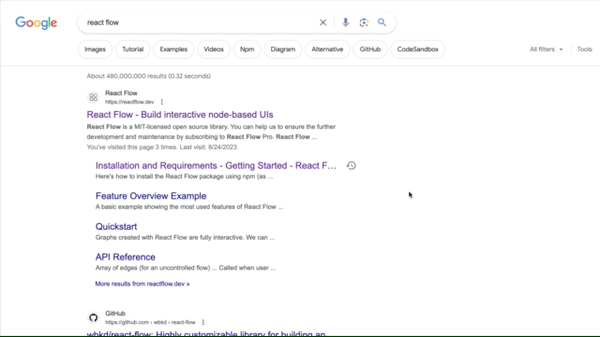

# custom-components-examples

Repository of example custom components built and maintained by the Superblocks team

In order to match the development pattern for custom components, each example component or set of components is uploaded as part of an app directory.

You can easily download any example component from this repository and copy it into your app directory. Be sure to also copy over the `package.json` & `package-lock.json` files to obtain the relevant dependencies.

## Contribution

This project is open to contributions and pull requests. The code in this repo is provided via an MIT Licence.

## Learn More

Check out the full feature write up on the [Superblocks Blog.](https://www.superblocks.com/blog/introducing-custom-components-in-superblocks).

Learn more about getting started with [Custom Components.](https://docs.superblocks.com/applications/custom-components)
