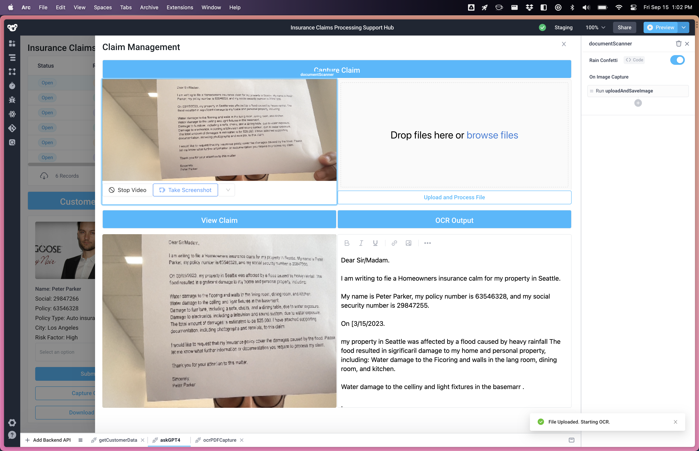
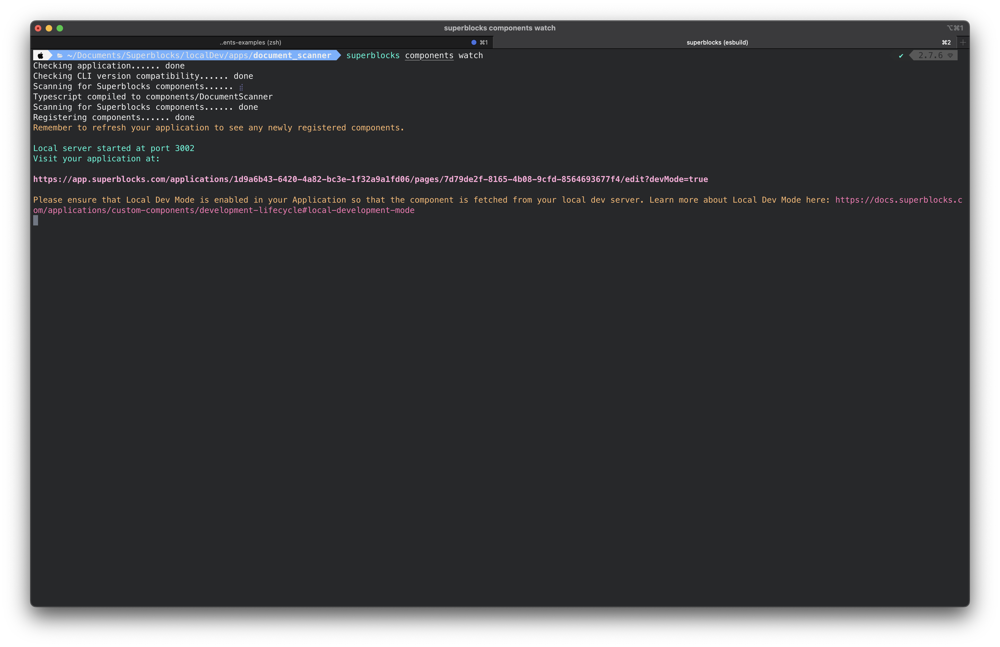
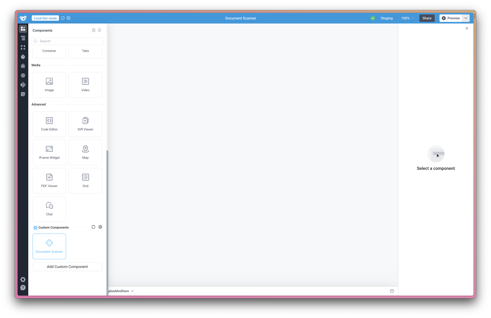
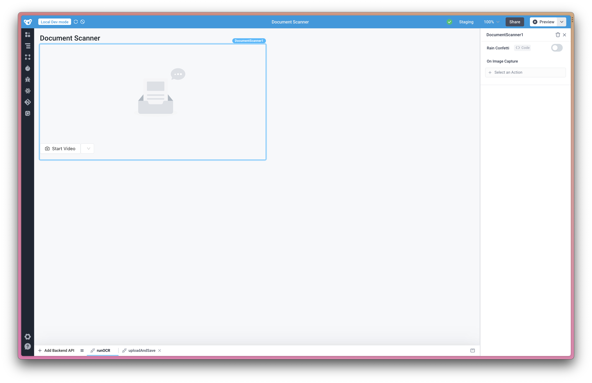

# Document Scanner Component



This is a Custom Component for Superblocks, that uses [React-Webcam](https://github.com/mozmorris/react-webcam) to bring image capture inside the Superblocks frontend.

Getting started
=====

### Requirements

To deploy this project you'll need accounts for the following services:

- [Superblocks](https://superblocks.com/)

### Setup

* Download this repository
* Install the Superblocks CLI & initialize your Superblocks repo
  * `npm install -g @superblocksteam/cli@latest`
* Log into your account
  * `superblocks login`
* Create a new local directory for your Superblocks resources
```bash
mkdir [MY_SUPERBLOCKS_DIRECTORY]
cd [MY_SUPERBLOCKS_DIRECTORY]
```
* Initialize your Superblocks repo locally
  * `superblocks init [MY_APPLICATION_URL] -m latest-edits`
* Copy everything from this component into your app directory. Be sure to also copy over the `package.json` & `package-lock.json` files to obtain the relevant dependencies.
* Install dependencies
  * `npm install`
* Run the component and open the provided URL.
  * `superblocks components watch`
  * 
* Add the custom component from the component panel
  * 
  * 

Learn More
=======

Check out the [full webinar where we build this component live.](https://www.superblocks.com/webinar/custom-components/).

License
=======

Code released under the MIT license. See [../Licence.md](licence.md) for further details.
