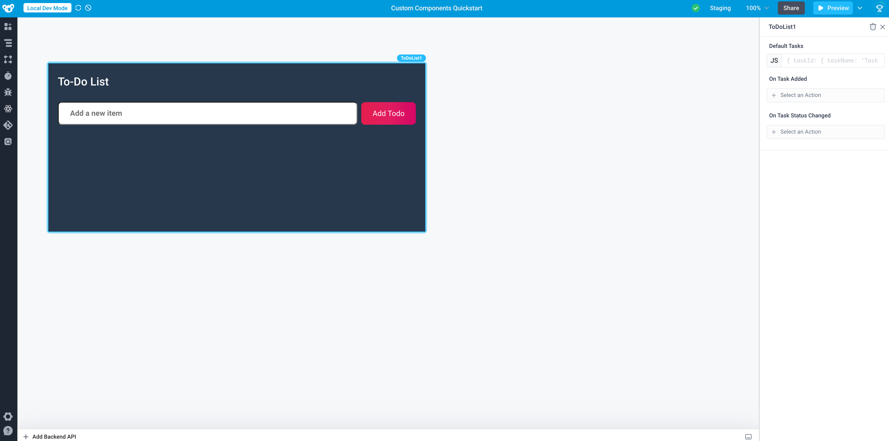

# To-Do List Example Component

This directory contains the example component provided by the Superblocks CLI. View a live demo of this component on [Superblocks](https://app.superblocks.com/applications/a0457899-7b3b-467f-99df-ecc50be27787/pages/ad9383f4-8438-4686-942c-1a182506d0a9).

You can initialize this component directly in the CLI by running `superblocks components create --example`.

We recommend following along with our [Quickstart Guide](https://docs.superblocks.com/applications/custom-components/quickstart), which breaks down this component in detail and walks through adding new features to the component.
